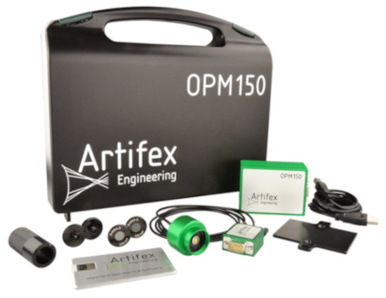

# Artifex Engineering OPM150
Artifex Optical Power Meter OPM150 is a low cost, versatile power monitor for use in the lab and for laser servicing as well as for OEM applications. It's design for precise measurement of power, from nW to kW, for use in the lab and for OEM applications.

## A very wide range of wavelength and powers.
Various diode materials allow measurement from 250nm up to 2490nm.

Heads are available covering 250-1000nm, 800-1550nm, 400-1600nm, 800-2000nm, 1000-2200nm and 1300-2490nm. Each head is automatically recognized and its individual calibration data are uploaded to the system.

Thus, changing wavelength range is as simple as swapping heads - all with one base unit.

We offer calibrated attenuation filters which extend the range of the free beam heads by up to three orders of magnitude. The user may load up to 5 separate filter curves to expand the dynamic range and functionality of the unit while ensuring proper calibration.

Calibrated integrating spheres compatible to the OPM150 system round up the selection.

With a response time of 100µs and sampling rates up to 600S/s, there is much more to see than with a thermopile sensor. And no thermal drift to worry about either!