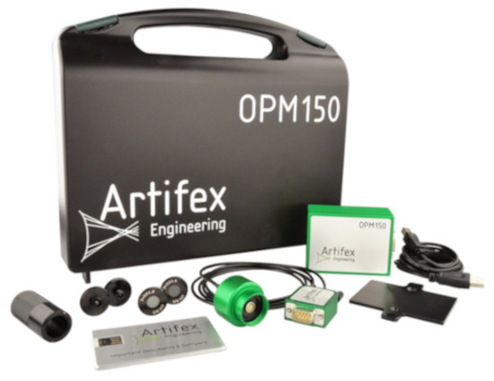

# Artifex Engineering OPM150
Artifex Optical Power Meter OPM150 is a low cost, versatile power monitor for use in the lab and for laser servicing as well as for OEM applications. It's designed for precise measurement of power, from nW to kW, for use in the lab and for OEM applications.

## Setup

* Connect the OPM150 to a free USB port of your computer using the supplied USB cable.
* 

## Features

* Select the power or intensity in the field 'Unit'
* If selected unit is an intensity unit, enter the aperture in the field 'Aperture'
* Enter the wavelength in nm in the field 'Wavelength in nm'. You can use the parameter syntax {...} to change the wavelength dynamically.
* You can select a fixed gain in the field 'Gain' or use 'Auto' for automatic gain selection.
* The field 'Filter' allows you to select a filter factor.
* To measure at different wavelengths please change use different sensor heads. Heads are available covering 250-1000nm, 800-1550nm, 400-1600nm, 800-2000nm, 1000-2200nm and 1300-2490nm. Each head is automatically recognized and its individual calibration data are uploaded to the system.
