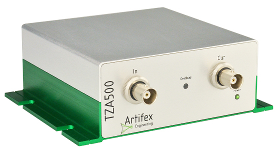

# Artifex Engineering TZA500
The transimpedance amplifier TZA500 is designed for precise measurement of current, from pA to mA. The output is a voltage linearly proportional to the input current.

## Setup

* Connect the TZA500 to a free USB port of your computer using the supplied USB cable.
* The drivers should install automatically via the Windows Update system. If errors occur, install the drivers manually or use the Artifex application software. The drivers are supplied with the TZA500 on a USB flash drive or can be downloaded from the website (www.artifex-engineering.com).
* Connect an source to the input receptacle of the base unit.

## Usage

* In the "Unit" field, select the unit in which you want to display the measured values.
     - You can choose between:
         - A (Ampere) - The detector current
         - W (Watt) - The measured optical power. Selecting this option displays the "Sensitivity" input field. For example if you are using a photodiode as a detector, you can enter the sensitivity and get the optical power value.
* Gain: You can select a fixed gain in the field 'Gain' or use 'Auto' for automatic gain selection.
* Invert Polarity: Inverts the input current.
* Bandwidth: The analog bandwidth of the amplifier can be changed. By reducing it, noise in the signal can be removed and the signal can be slowed down.
* Initial Autozero and Reset: This function sets the current level of each gain stage to zero, making signal changes easier to observe.  This function is performed before a measurement. The reset cancels the automatic zeroing, and the signal returns to it's original level.